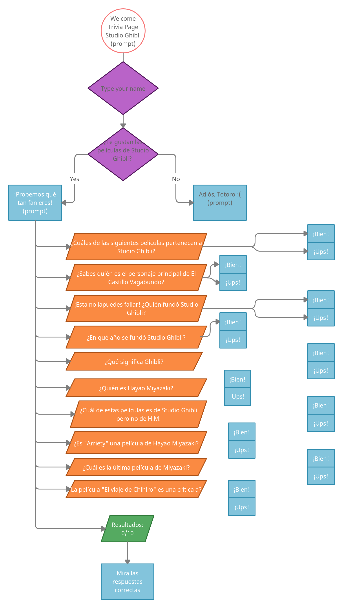

# Trivia Studio Ghibli

## (Read Me Markdown_Elibabah)

Problemática: Trivia para encontrar qué tanto sabes de Studio Ghibli.

El objetivo principal de este proyecto es tener una primera experiencia desarrollando una
aplicación web que tenga interacción con el usuario a través de un navegador, conocer bien cómo
solucionar el problema y trabajar en equipo.

Otro objetivo es pensar y planear el desarrollo del software que debería resolver el problema:

1. Entender el problema y los requerimientos del proyecto.
2. Diseñar el flujo en diagrama
3. Diseñar la interfaz del usuario
4. Escribir el pseudocódigo
5. Escribir el código
6. Validar el código
7. Presentar en local el proyecto

## Requerimientos

- HTML y CSS
- Uso de HTML semántico.
- Uso de selectores de html con clases de CSS.
- Seguir la estructura del LayOut de una WebApplication
- JavaScript
- Tipos de Datos
- Declaración correcta de variables (cont y let)
- String concatenación
- Uso de condicionales (if-else | switch | operador ternario)
- Uso de funciones (parâmetros | argumentos | valor de retorno)

## Criterios de aceptación

1. La trivia debe permitir al usuario ingresar su nombre y mostrarlo en sus resultados.

2. La trivia debe tener un Flujo de salida, si el usuario no quiere participar.

3. La trivia debe incluir al menos 10 preguntas en prompt y recibe las respuestas del usuario.

4. Inmediatamente al terminar la última pregunta, debería mostrar los resultados, cantidad de buenas y

cantidad de malas, así como las respuestas correctas.

5. Entregar una ulr de Github Pages para probar la trivia.

**Fuente**: *Ajusco Coding Bootcamp*

---
---

## Diagrama de flujo

